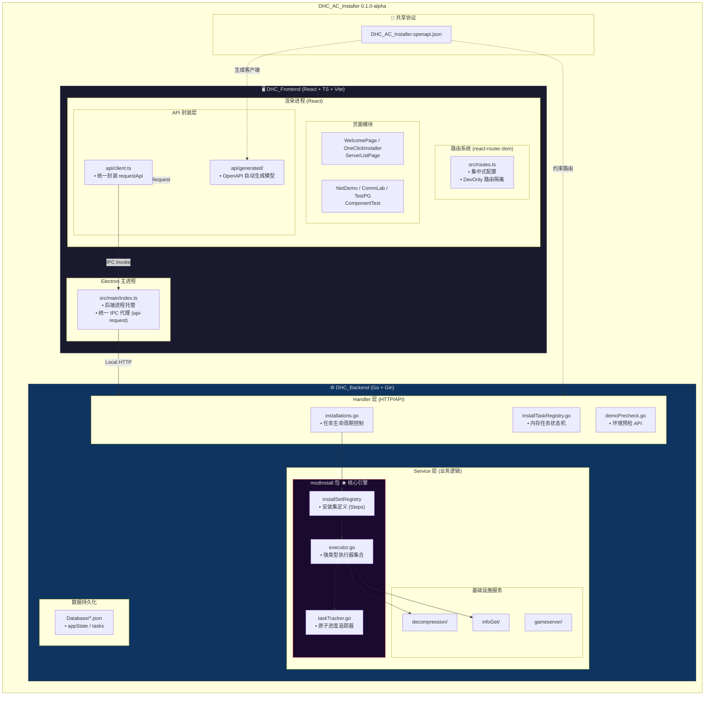
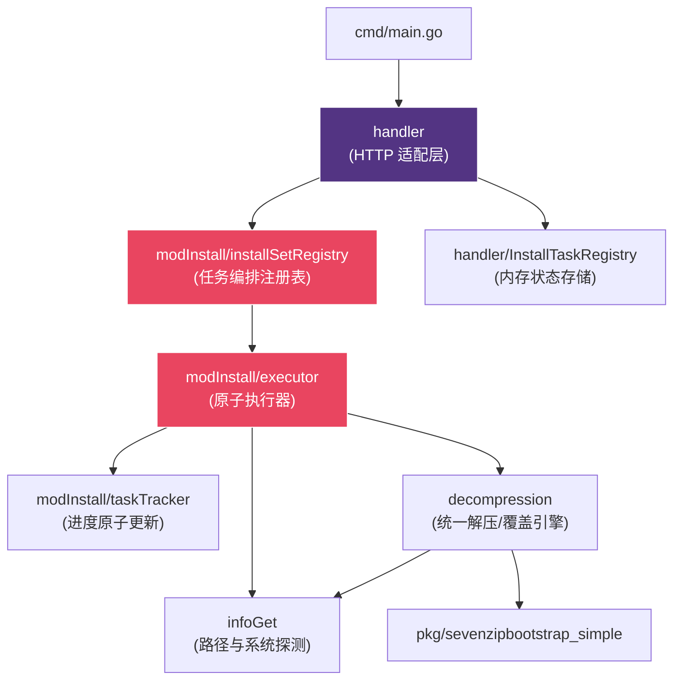
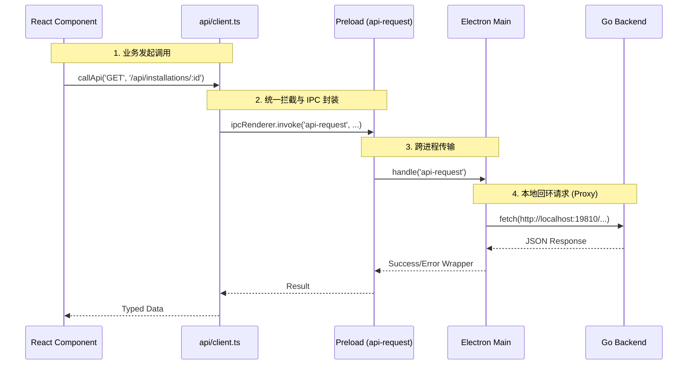
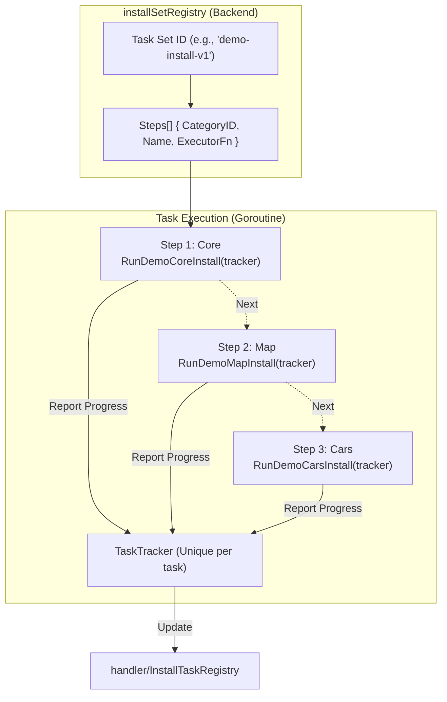

# DHC AC Installer 全局架构分析 (0.1.0-alpha)

> 生成日期：2026-04-20  
> 状态：**重构完成**（基于 0.1.0-alpha 正式版）  
> 目的：为系统长期维护提供精确的架构地图，详细描述重构后的模块边界与数据流。

---

## 一、项目全局架构总览 (0.1.0-alpha)

重构后的架构核心在于 **“契约驱动”** 和 **“职责分离”**。后端转变为纯粹的任务执行引擎，前端转变为声明式的状态驱动 UI。

---

## 二、后端包依赖关系图 (重构后)

重构后消除了循环依赖，建立了清晰的层级：`Handler -> Registry -> Service -> Engine -> Infra`。

---

## 三、前端路由与组件拓扑 (react-router-dom)

重构后废弃了 switch-case 手动切换页面，改用标准的声明式路由。

```mermaid
graph LR
    subgraph App["App.tsx (Main Layout)"]
        Nav["Nav (Side Bar)"]
        Content["Content (Router Outlet)"]
    end
    
    Nav -->|"LinkTo"| Router
    
    subgraph Router["BrowserRouter (src/routes.ts)"]
        direction TB
        Home["/ → WelcomePage"]
        SL["/servers → ServerListPage"]
        OCI["/install → OneClickInstaller ★"]
        RIM["/resource → ResourceImportManager"]
        Set["/settings → SettingsPage"]
        
        subgraph DevOnly["DevOnly (Condition Render)"]
            ND["/dev/net-demo"]
            CT["/dev/comp-test"]
            TP["/dev/playground"]
            CL["/dev/lab"]
        end
    end
    
    OCI --> OCI_Sub["子路由: /install/precheck | /install/progress | /install/post"]
    
    style OCI fill:#e94560,stroke:#fff,color:#fff
    style DevOnly fill:#2c3e50,stroke:#e67e22,stroke-dasharray: 5 5
```

---

## 四、前后端通信链路详解

重构后统一了调用入口，不再零散使用 `window.api`。

---

## 五、安装流程详解 (核心业务 v1.0.0)

### 5.1 安装集执行架构 (Registry-Based)

这是重构后最重要的变化：安装流程由“步骤列表”驱动，而非硬编码。

### 5.2 模组安装数据流 (重构后)

重构后的模组安装流程更强调**临时缓存与原子覆盖**。

```mermaid
graph LR
    Source["外部资源 (.zip/.7z)"] --> Decomp["Decompression Engine"]
    Decomp --> Cache["importResourceCache/<br/>(临时解压区)"]
    
    Cache --> Detect["Resource Detection<br/>(类型识别)"]
    Detect --> Store["resources/{type}/{pkg}/<br/>(持久化资源库)"]
    
    Store --> Install["Install Executor"]
    Install --> GameCache["resources/cache/<br/>(安装中间层)"]
    GameCache -->|"OverrideControl (原子覆盖)"| GameDir["Assetto Corsa Dir"]
```

---

## 六、HTTP API 路由全览 (v1.0.0)

| 路由路径 | 方法 | 处理器 (Handler) | 说明 |
| :--- | :--- | :--- | :--- |
| `/api/installations` | POST | `createInstallation` | 根据 setId 创建异步安装任务 |
| `/api/installations/:id/progress` | GET | `getInstallationProgress` | 轮询任务进度及各步骤状态 |
| `/api/demo/precheck/resources` | GET | `demoPrecheckResources` | 检查外部资源包完整性 |
| `/api/demo/precheck/cm` | GET | `demoPrecheckCm` | 探测 Content Manager 路径 |
| `/api/AppState` | GET | `getAppState` | 获取应用全局持久化状态 |
| `/api/GetServerInfo` | GET | `GetServerInfo` | 探测游戏服务器状态与 Ping |
| `/api/lab/task/*` | MIX | `labdemo.go` | **(DevOnly)** 实验室压力测试接口 |

---

## 七、架构演进诊断：痛点解决报告

| 旧架构痛点 (v0.x) | 重构解决方案 (v1.0.0) | 收益评价 |
| :--- | :--- | :--- |
| **P1: 前端伪路由** (switch-case) | 引入 `react-router-dom` | **高**：支持后退、路由隔离、代码结构更符合现代 React 开发。 |
| **P2: 后端安装逻辑耦合** | 建立 `installSetRegistry` | **极高**：新增安装模式只需注册步骤，无需修改 Handler 代码。 |
| **P3: Handler 职责过重** | 抽离 `modInstall` 服务包 | **高**：Handler 仅负责 HTTP 转换，业务逻辑集中在 Service 层。 |
| **P4: 前端直连文件系统** | 废弃 fs 直接调用，改用 AppState API | **中**：消除跨进程竞争，数据流向可控。 |
| **P5: 死代码与幽灵文件** | 深度清理 20+ 个废弃 Go/TS 文件 | **高**：降低维护心智负担，包体积减小。 |
| **P6: 命名不一致** | `Database` -> `database` 等规范化 | **低**：提升代码专业度与可读性。 |

---

## 八、文件级架构对照表 (New v1.0.0)

| 目录/文件 | 核心职责 | 性质 |
| :--- | :--- | :--- |
| `DHC_Backend/handler/` | HTTP 接口适配、任务注册中心 | 接口层 |
| `DHC_Backend/models/service/modInstall/` | 安装集注册表、TaskTracker、执行器实现 | **核心逻辑层** |
| `DHC_Backend/models/service/decompression/` | 万能解压、原子覆盖、路径校验 | 引擎层 |
| `DHC_Frontend/src/renderer/src/routes.ts` | 声明式路由定义、菜单配置 | 导航层 |
| `DHC_Frontend/src/renderer/src/api/client.ts` | 统一请求封装、IPC 桥接、错误拦截 | 通信层 |

---
