# DHC AC Installer 全局架构分析

> 生成日期：2026-04-08  
> 目的：为重构提供完整的架构视图、问题诊断与改进方案

---

## 一、项目全局架构总览

```mermaid
graph TB
    subgraph Project["DHC_AC_Installer 项目"]
        direction TB
        
        subgraph Frontend["🖥️ DHC_Frontend（Electron + React）"]
            direction TB
            
            subgraph FE_Main["Electron 主进程"]
                FE_MainEntry["src/main/index.ts<br/>• createWindow()<br/>• IPC 代理 fetch<br/>• 可选拉起后端进程"]
            end
            
            subgraph FE_Preload["Preload 桥接层"]
                FE_PreloadEntry["src/preload/index.ts<br/>• window.api.requestApi()"]
            end
            
            subgraph FE_Shared["共享层"]
                FE_SharedAPI["src/shared/index.ts<br/>• ipcFetch 包装<br/>• Api 实例（DefaultApi）"]
            end
            
            subgraph FE_Renderer["渲染进程（React）"]
                direction TB
                
                subgraph FE_Core["核心框架"]
                    FE_AppEntry["main.tsx → App.tsx<br/>• Semi ConfigProvider<br/>• activeKey 伪路由<br/>• 侧栏 Nav 布局"]
                end
                
                subgraph FE_Contexts["状态管理（Context）"]
                    FE_DevMode["DevModeContext<br/>• 开发者模式开关"]
                    FE_NavCtx["NavigationContext<br/>• navigate / goHome"]
                end
                
                subgraph FE_Pages_Core["核心业务页面"]
                    FE_Welcome["WelcomePage"]
                    FE_OneClick["OneClickInstaller<br/>• requestBackend()<br/>• 安装模式选择<br/>• 预检/安装/完成流程"]
                    FE_Progress["InstallProgressPage<br/>• 轮询进度 API"]
                    FE_ServerList["ServerListPage"]
                    FE_Settings["SettingsPage"]
                    FE_Resource["ResourceImportManager"]
                    FE_Wiki["ShutokoWiki"]
                end
                
                subgraph FE_Pages_Aux["辅助/实验页面"]
                    FE_Shader["ShaderInstaller"]
                    FE_ShaderV1["ShaderInstaller.v1"]
                    FE_CarPack["CarPackInstaller"]
                    FE_Custom["CustomInstallWizard"]
                    FE_NetDemo["NetDemo"]
                    FE_CompTest["ComponentTest"]
                    FE_TestPG["TestPlayground"]
                    FE_CommLab["CommunicationLab"]
                end
                
                subgraph FE_Components["公共组件"]
                    FE_Breadcrumb["HomeBreadcrumb"]
                    FE_DevPanel["DevModePanel"]
                    FE_ServerCard["serverCard"]
                    FE_Modal["joinServerInstructionsModal"]
                    FE_Tutorial["VideoTutorialSection / TutorialCard"]
                end
                
                subgraph FE_OCI_Sub["OneClickInstaller 子模块"]
                    FE_OCI_Types["types.ts"]
                    FE_OCI_Const["constants.tsx"]
                    FE_OCI_Pre["PreCheckPage"]
                    FE_OCI_Post["PostInstallPage"]
                    FE_OCI_Normal["NormalInstaller"]
                    FE_OCI_Clean["CleanInstallWizard"]
                    FE_OCI_Ctx["OneClickInstallerContext ⚠️ 未使用"]
                end
            end
            
            subgraph FE_API["OpenAPI 生成层"]
                FE_DefaultAPI["apis/DefaultApi.ts<br/>• GetGamePath<br/>• GetServerInfo"]
                FE_Models["models/*.ts"]
                FE_Runtime["runtime.ts"]
            end
            
            subgraph FE_Services["本地服务"]
                FE_AppState["appStateFileStore.ts<br/>• 直接读写 appState.json"]
            end
        end
        
        subgraph Backend["⚙️ DHC_Backend（Go + Gin）"]
            direction TB
            
            subgraph BE_Entry["入口"]
                BE_Main["cmd/main.go<br/>• gin.Default()<br/>• CORS<br/>• 127.0.0.1:19810"]
            end
            
            subgraph BE_Handler["Handler 层（HTTP 适配）"]
                BE_Init["init.go<br/>• InitGin()<br/>• GetServerInfo()<br/>• getGamePath() ⚠️ 占位"]
                BE_Install["installations.go<br/>• createInstallation()<br/>• getInstallationProgress()<br/>• runInstallExecutor()"]
                BE_DemoPrecheck["demoPrecheck.go<br/>• demoPrecheckResources<br/>• demoPrecheckDlcCarPack<br/>• demoPrecheckCm"]
                BE_AppState["appStateHandler.go"]
                BE_SysInfo["systemInfoHandler.go ⚠️ 未注册"]
                BE_Lab["labdemo.go"]
                BE_TestPG["testplayground.go"]
                BE_SyncEx["sync_progress_query_example.go ⚠️ 示例"]
                BE_OldInst["old_installtion.go ⚠️ 已废弃"]
            end
            
            subgraph BE_Service["Service 层（业务逻辑）"]
                direction TB
                
                subgraph BE_ModInstall["modInstall 包 ★ 核心"]
                    BE_Executor["executor.go<br/>• RunDemoCMInstall()<br/>• RunRealCMInstall()<br/>• RunMinimalModsetInstall()"]
                    BE_DemoInst["demoInstaller.go<br/>• RunDemoCore/Weather/Map/Cars<br/>• DetectDemoResourcesIntegrity()<br/>• SimEnvDevInstallCleanup()"]
                    BE_ModMain["modInstall.go<br/>• DhcResoucePkgImport()<br/>• MultiModInstall()<br/>• SingleModInstall()"]
                    BE_ResDet["resourceDetection.go<br/>• ImportResourceDetection()<br/>• BuildCompleteResourceCatalog()"]
                    BE_InstCM["installCm.go<br/>• InstallCm()<br/>• InstallCmWithTracker()<br/>• DetectLocalCmPath()"]
                    BE_Tracker["taskTracker.go<br/>• TaskTracker<br/>• ProgressSnapshot"]
                    BE_Types["types.go"]
                end
                
                subgraph BE_Decomp["decompression 包"]
                    BE_DecompMain["decompression.go<br/>• Decompression()<br/>• DecompressionWithOptions()"]
                    BE_Dft["dft.go<br/>• DecodeDhcFileTagConfig()"]
                    BE_Override["overrideControl.go<br/>• OverrideControl()"]
                    BE_DirSet["dirSet.go<br/>• AutoSetResouceDirLocal()"]
                end
                
                subgraph BE_InfoGet["infoGet 包"]
                    BE_GamePath["getGamePath.go<br/>• GetGamePath()<br/>• GetGamePathAuto()"]
                    BE_SysInfoSvc["getSysInfo.go<br/>• GetSysInfo()<br/>• GetDiskUsage()"]
                    BE_AppInfo["getAppInfo.go<br/>• GetAppState()<br/>• UpsertServerDisclaimerState()"]
                    BE_DiskInfo["getDiskInfo.go<br/>• GetDiskInfo()"]
                    BE_FileInfo["getFileInfo.go"]
                end
                
                subgraph BE_GameServer["gameserver 包"]
                    BE_GetInfo["getinfo.go<br/>• GetServerInfo()<br/>• GetPing()"]
                end
                
                subgraph BE_Log["servicelog 包"]
                    BE_SvcLog["servicelog.go"]
                end
                
                subgraph BE_TypesPkg["types 包"]
                    BE_TypesGlobal["types.go"]
                end
            end
            
            subgraph BE_Pkg["pkg 层（基础设施）"]
                BE_7z["sevenzipbootstrap/"]
                BE_7zSimple["sevenzipbootstrap_simple/"]
            end
            
            subgraph BE_DTO["apiModels（DTO）"]
                BE_ApiModels["OpenAPI 生成的请求/响应结构体"]
            end
        end
        
        subgraph Shared["📄 共享契约"]
            OpenAPI["DHC_AC_Installer.openapi.json"]
        end
    end
    
    %% 通信链路
    FE_PreloadEntry -->|"IPC: api-request"| FE_MainEntry
    FE_MainEntry -->|"HTTP fetch"| BE_Main
    FE_SharedAPI --> FE_PreloadEntry
    
    %% 前端内部
    FE_AppEntry --> FE_Pages_Core
    FE_AppEntry --> FE_Pages_Aux
    FE_OneClick --> FE_OCI_Sub
    FE_OneClick --> FE_Progress
    
    %% 后端内部
    BE_Main --> BE_Init
    BE_Init --> BE_Install
    BE_Init --> BE_DemoPrecheck
    BE_Init --> BE_AppState
    BE_Init --> BE_Lab
    BE_Init --> BE_TestPG
    
    BE_Install --> BE_Executor
    BE_Install --> BE_DemoInst
    BE_Install --> BE_Tracker
    BE_DemoPrecheck --> BE_DemoInst
    BE_DemoPrecheck --> BE_InstCM
    
    BE_Executor --> BE_InstCM
    BE_Executor --> BE_ModMain
    BE_DemoInst --> BE_ResDet
    BE_ModMain --> BE_DecompMain
    BE_ModMain --> BE_Override
    BE_DecompMain --> BE_7zSimple
    
    BE_ModMain --> BE_GamePath
    BE_DecompMain --> BE_GamePath
    
    %% OpenAPI
    OpenAPI -.->|"代码生成"| FE_API
    OpenAPI -.->|"代码生成"| BE_DTO
    
    style Frontend fill:#1a1a2e,stroke:#16213e,color:#e0e0e0
    style Backend fill:#0f3460,stroke:#16213e,color:#e0e0e0
    style BE_ModInstall fill:#1a0a2e,stroke:#e94560,color:#e0e0e0
```

---

## 二、后端包依赖关系图

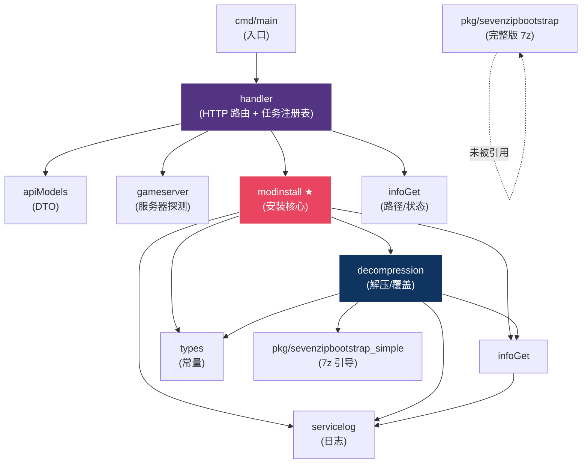

---

## 三、前端页面路由与组件依赖图

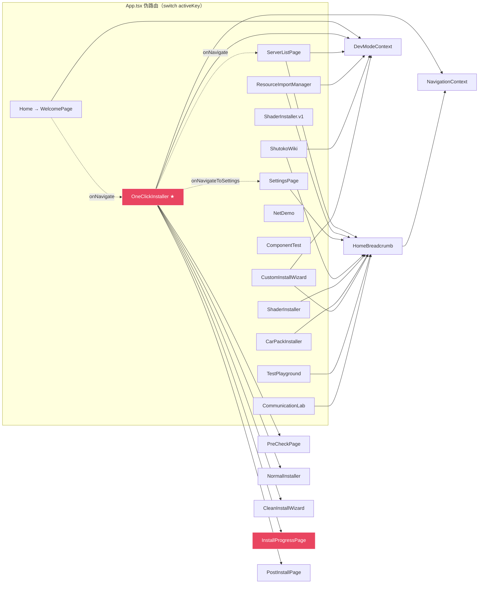

---

## 四、前后端通信链路详解

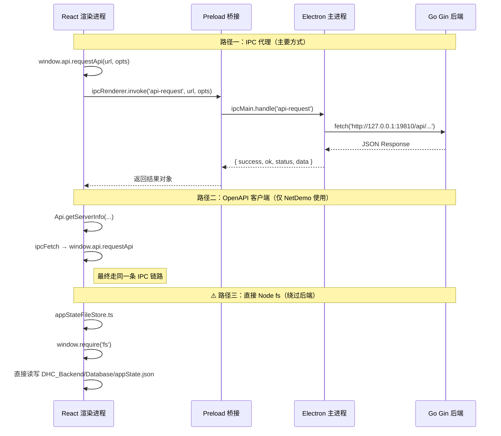

---

## 五、安装流程详解（核心业务）

### 5.1 一键安装：前后端交互时序

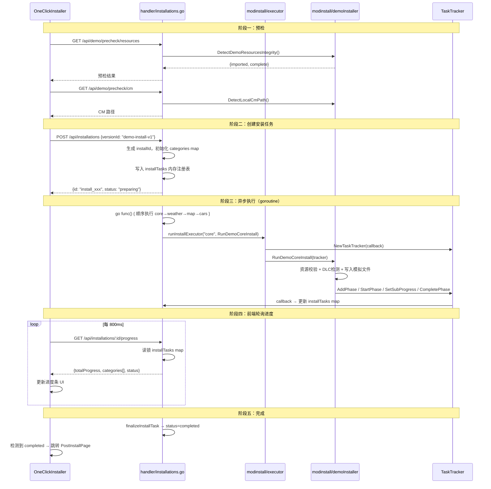

### 5.2 后端安装执行器架构

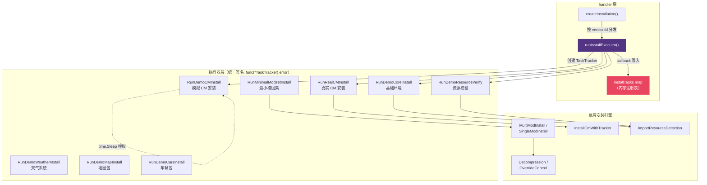

### 5.3 模组安装数据流

```mermaid
graph LR
    subgraph Input["输入"]
        Pkg["外部资源包<br/>pkg.zip / .7z / .rar"]
        Dir["已解压目录"]
    end
    
    subgraph Import["引入阶段"]
        PkgImport["DhcResoucePkgImport()"]
        Cache1["importResourceCache/<br/>（临时解压）"]
        Detect["ImportResourceDetection()<br/>资源类型识别"]
    end
    
    subgraph Storage["资源库"]
        Res["resources/{type}/{pkg}/{mod}/<br/>持久存储"]
    end
    
    subgraph Install["安装阶段"]
        Multi["MultiModInstall()"]
        Single["SingleModInstall()<br/>压缩包 → 中间目录 → 游戏"]
        SingleDir["SingleModInstallFromDir()<br/>目录 → 游戏（跳过解压）"]
        Cache2["resources/cache/{type}/{name}/<br/>（安装中间目录）"]
    end
    
    subgraph Output["输出"]
        Game["游戏目录<br/>content/{cars|tracks|...}/"]
    end
    
    Pkg --> PkgImport
    PkgImport --> Cache1
    Cache1 --> Detect
    Detect --> Res
    
    Res --> Multi
    Dir --> Multi
    Multi --> Single
    Multi --> SingleDir
    Single --> Cache2
    Cache2 -->|"OverrideControl()"| Game
    SingleDir -->|"OverrideControl()"| Game
    
    style Res fill:#0f3460,stroke:#fff,color:#fff
    style Game fill:#16a085,stroke:#fff,color:#fff
```

---

## 六、HTTP API 路由全览

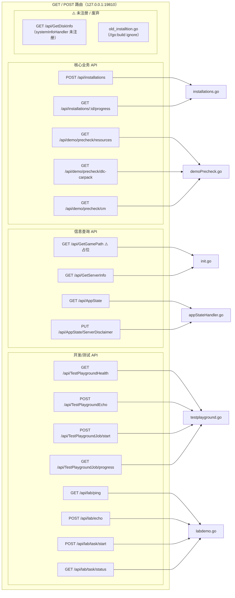

---

## 七、架构问题诊断

### 7.1 问题标注图

```mermaid
graph TB
    subgraph Problems["🔴 当前架构问题一览"]
        direction TB
        
        subgraph P1["问题1：前端页面膨胀 & 伪路由"]
            P1_desc["App.tsx 用 switch/case 管理 14 个页面<br/>无 React Router，无 URL 历史<br/>页面间导航靠 props 回调传递"]
        end
        
        subgraph P2["问题2：Demo/Real 代码纠缠"]
            P2_desc["demoInstaller.go（686行）<br/>RunDemoCoreInstall 内嵌资源校验逻辑<br/>与 RunDemoResourceVerify 大量重复<br/>Demo 模拟 & 真实检测混在同一文件"]
        end
        
        subgraph P3["问题3：handler 层职责过重"]
            P3_desc["installations.go 包含：<br/>• 任务状态类型定义<br/>• 内存注册表<br/>• demoPaceState 节流逻辑<br/>• 执行器桥接<br/>• 进度计算<br/>共 450 行，应拆分"]
        end
        
        subgraph P4["问题4：前端直接操作后端文件"]
            P4_desc["appStateFileStore.ts<br/>通过 window.require('fs')<br/>直接读写 DHC_Backend/Database/appState.json<br/>绕过了后端 API 层"]
        end
        
        subgraph P5["问题5：死代码 & 幽灵文件"]
            P5_desc["• old_installtion.go（//go:build ignore）<br/>• systemInfoHandler.go（未注册路由）<br/>• sync_progress_query_example.go（示例代码）<br/>• ShaderInstaller.v1.tsx（旧版本保留）<br/>• OneClickInstallerContext.tsx（无消费者）<br/>• NetDemo / ComponentTest / TestPlayground<br/>  （开发调试页面混入正式导航）"]
        end
        
        subgraph P6["问题6：两套 HTTP 调用方式并存"]
            P6_desc["方式A：window.api.requestApi（手动拼 URL）<br/>方式B：OpenAPI 生成的 DefaultApi 客户端<br/>大部分页面用方式A，仅 NetDemo 用方式B<br/>OpenAPI 生成的模型几乎未被使用"]
        end
        
        subgraph P7["问题7：后端缺乏分层"]
            P7_desc["handler 直接调用 modinstall 函数<br/>无 service 接口层（interface）<br/>modinstall 包内文件职责边界模糊：<br/>executor.go vs demoInstaller.go vs modInstall.go"]
        end
        
        subgraph P8["问题8：命名不一致"]
            P8_desc["• Database（拼写错误，应为 Database）<br/>• modInstall 包名 vs modinstall（Go 约定小写）<br/>• getGamePath 占位函数返回硬编码<br/>• Demo 前缀函数实际包含真实逻辑"]
        end
    end
    
    style P1 fill:#8B0000,stroke:#fff,color:#fff
    style P2 fill:#8B0000,stroke:#fff,color:#fff
    style P3 fill:#8B0000,stroke:#fff,color:#fff
    style P4 fill:#8B0000,stroke:#fff,color:#fff
    style P5 fill:#8B0000,stroke:#fff,color:#fff
    style P6 fill:#8B0000,stroke:#fff,color:#fff
    style P7 fill:#8B0000,stroke:#fff,color:#fff
    style P8 fill:#8B0000,stroke:#fff,color:#fff
```

### 7.2 问题严重程度矩阵

| 问题 | 严重程度 | 影响范围 | 修复难度 |
|------|---------|---------|---------|
| P2: Demo/Real 纠缠 | 🔴 高 | 后端核心 | 中 |
| P3: handler 职责过重 | 🔴 高 | 后端 handler | 中 |
| P7: 后端缺乏分层 | 🔴 高 | 全后端 | 高 |
| P1: 前端伪路由 | 🟡 中 | 全前端 | 中 |
| P4: 前端直接操作文件 | 🟡 中 | 数据一致性 | 低 |
| P6: 两套 HTTP 调用 | 🟡 中 | 前端 | 中 |
| P5: 死代码 | 🟢 低 | 代码整洁度 | 低 |
| P8: 命名不一致 | 🟢 低 | 可读性 | 低 |

---

## 八、理想架构设计

### 8.1 理想后端架构

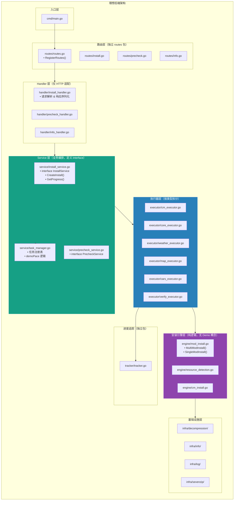

### 8.2 理想前端架构

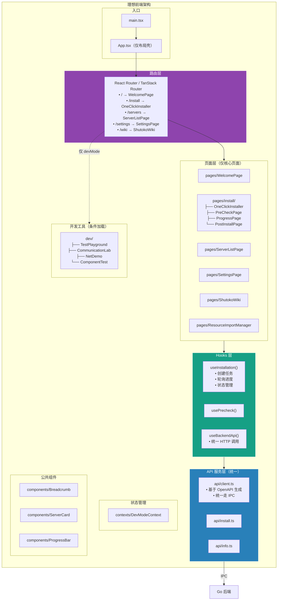

---

## 九、重构建议与优先级路线图

### 9.1 重构路线图

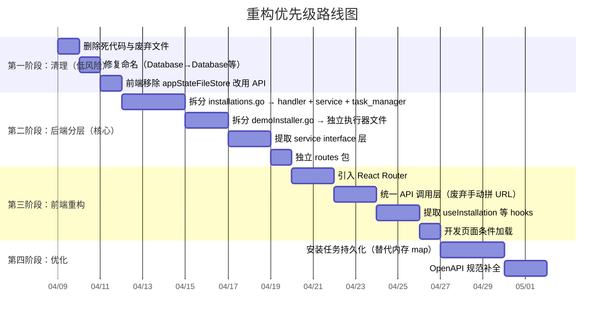

### 9.2 具体修改建议

#### 第一阶段：清理

| 操作 | 文件 | 说明 |
|------|------|------|
| 删除 | `handler/old_installtion.go` | 已 `//go:build ignore`，无用 |
| 删除 | `handler/sync_progress_query_example.go` | 示例代码，不应在生产包内 |
| 删除 | `handler/systemInfoHandler.go` | 路由未注册，handler 为空函数 |
| 删除 | `ShaderInstaller.v1.tsx` | 旧版本，已有新版 |
| 删除 | `OneClickInstallerContext.tsx` | 无消费者 |
| 重命名 | `Database/` → `database/` | 修复拼写错误 |
| 迁移 | `appStateFileStore.ts` | 改为调用 `GET/PUT /api/AppState` |

#### 第二阶段：后端分层

**当前 `installations.go`（450行）应拆为：**

| 新文件 | 内容 |
|--------|------|
| `handler/install_handler.go` | 仅 `createInstallation` 和 `getInstallationProgress` 的 HTTP 解析 |
| `service/task_manager.go` | `installTask`、`installTasks` map、`demoPaceState`、`calcTotalProgress` |
| `service/install_orchestrator.go` | `runInstallExecutor`、`finalizeInstallTask`（编排逻辑） |

**当前 `demoInstaller.go`（686行）应拆为：**

| 新文件 | 内容 |
|--------|------|
| `executor/verify_executor.go` | `RunDemoResourceVerify`（去掉 Demo 前缀） |
| `executor/core_executor.go` | `RunDemoCoreInstall` → `RunCoreInstall` |
| `executor/weather_executor.go` | `RunDemoWeatherInstall` → `RunWeatherInstall` |
| `executor/map_executor.go` | `RunDemoMapInstall` → `RunMapInstall` |
| `executor/cars_executor.go` | `RunDemoCarsInstall` → `RunCarsInstall` |
| `internal/devutil/simenv.go` | `assertDevGamePathSafe`、`writeDemoTxt*`、`SimEnvDevInstallCleanup` |

**提取资源校验逻辑（消除 RunDemoCoreInstall 与 RunDemoResourceVerify 的重复）：**

```
// 新建 engine/resource_verify.go
func VerifyResources(tracker *TaskTracker, types []ResourceType) error { ... }

// RunCoreInstall 调用：
VerifyResources(tracker, requiredTypes)
// RunResourceVerify 也调用同一函数
```

#### 第三阶段：前端重构

1. **引入路由**：用 `react-router-dom` 的 `HashRouter`（Electron 兼容），`App.tsx` 从 switch/case 变为 `<Routes>`
2. **统一 API 层**：废弃各页面手动拼 `window.api.requestApi`，统一使用 OpenAPI 生成的客户端或封装的 `api/*.ts`
3. **提取 hooks**：`useInstallation()`、`usePrecheck()`、`useServerInfo()` 等，将业务逻辑从组件中抽离
4. **开发页面隔离**：`TestPlayground`、`CommunicationLab`、`NetDemo`、`ComponentTest` 仅在 `isDevMode` 时加载到路由

---

## 十、文件级变更对照表

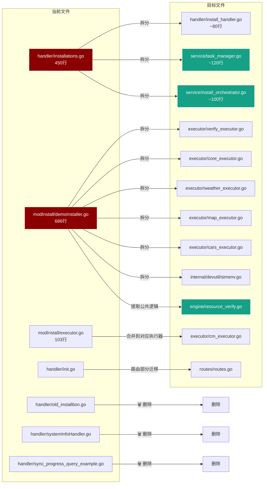
