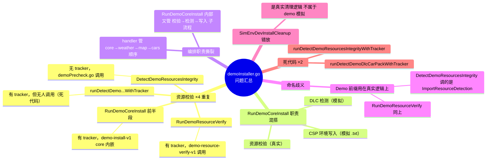
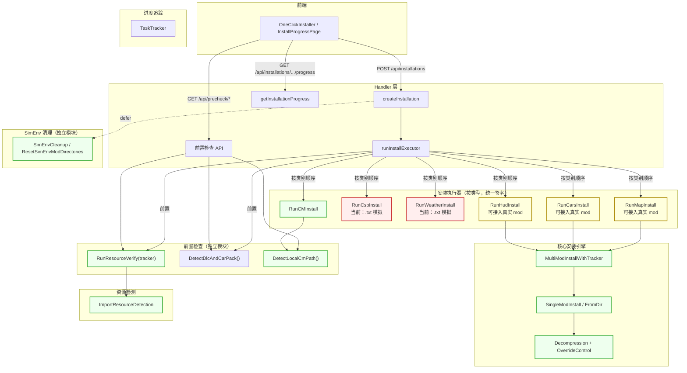

# 安装模块架构分析 — DEMO 职责审计

> 生成时间：2026-04-07  
> 目的：梳理当前安装流程中 DEMO 与 REAL 逻辑的边界，为重构提供参考

---

## 1. 当前调用链全景（标注 DEMO/REAL）

```mermaid
flowchart TB
    subgraph Frontend["前端 (React)"]
        OCI["OneClickInstaller.tsx"]
        TP["TestPlayground.tsx"]
    end

    subgraph Handler["Handler 层 (Gin)"]
        CI["createInstallation<br/>installations.go"]
        GIP["getInstallationProgress<br/>installations.go"]
        RIE["runInstallExecutor<br/>installations.go"]
        DP_R["GET /demo/precheck/resources<br/>demoPrecheck.go"]
        DP_D["GET /demo/precheck/dlc-carpack<br/>demoPrecheck.go"]
        DP_C["GET /demo/precheck/cm<br/>demoPrecheck.go"]
    end

    subgraph Executor["执行器层"]
        direction TB
        E_DCM["RunDemoCMInstall<br/>executor.go"]
        E_RCM["RunRealCMInstall<br/>executor.go"]
        E_MMS["RunMinimalModsetInstall<br/>executor.go"]
    end

    subgraph DemoInstaller["demoInstaller.go（问题集中区）"]
        direction TB
        DI_RV["RunDemoResourceVerify<br/>🔴 资源校验 第1份"]
        DI_CORE["RunDemoCoreInstall<br/>🔴 资源校验 第2份<br/>+ 模拟DLC检测<br/>+ 模拟.txt写入"]
        DI_W["RunDemoWeatherInstall<br/>模拟.txt"]
        DI_M["RunDemoMapInstall<br/>模拟.txt"]
        DI_CA["RunDemoCarsInstall<br/>模拟.txt"]
        DI_DRI["DetectDemoResourcesIntegrity<br/>🔴 资源校验 第3份"]
        DI_DDC["DetectDemoDlcAndCarPack<br/>模拟（读环境变量）"]
        DI_DEAD1["runDetectDemo...WithTracker<br/>🔴 资源校验 第4份<br/>⚠️ 死代码"]
        DI_DEAD2["runDetectDemoDlc...WithTracker<br/>⚠️ 死代码"]
        DI_CLEAN["SimEnvDevInstallCleanup<br/>✅ 真实逻辑，不属于DEMO"]
    end

    subgraph Core["核心安装层 (modInstall.go)"]
        MI_MULTI["MultiModInstallWithTracker"]
        MI_SINGLE["SingleModInstall"]
        MI_SDIR["SingleModInstallFromDir"]
        MI_IMPORT["DhcResoucePkgImport"]
        MI_RESET["ResetSimEnvModDirectories*"]
    end

    subgraph Detection["资源检测层 (resourceDetection.go)"]
        RD["ImportResourceDetection"]
        RD_CAT["BuildCompleteResourceCatalog"]
    end

    subgraph Tracker["进度追踪 (taskTracker.go)"]
        TT["TaskTracker"]
    end

    %% Frontend → Handler
    OCI -->|"POST versionId=demo-install-v1"| CI
    OCI -->|"POST versionId=demo-resource-verify-v1"| CI
    OCI -->|"POST versionId=cm-demo-v1"| CI
    OCI -->|"GET precheck"| DP_R & DP_D & DP_C
    TP -->|"POST versionId=cm-demo-v1"| CI

    %% Handler → Executor/DemoInstaller
    CI -->|"demo-resource-verify-v1"| RIE --> DI_RV
    CI -->|"demo-install-v1 core"| RIE --> DI_CORE
    CI -->|"demo-install-v1 weather"| RIE --> DI_W
    CI -->|"demo-install-v1 map"| RIE --> DI_M
    CI -->|"demo-install-v1 cars"| RIE --> DI_CA
    CI -->|"cm-demo-v1"| RIE --> E_DCM
    CI -.->|"defer"| DI_CLEAN

    %% Precheck Handler → DemoInstaller
    DP_R --> DI_DRI
    DP_D --> DI_DDC
    DP_C --> MI_CM["DetectLocalCmPath<br/>installCm.go"]

    %% DemoInstaller → Detection (真实调用)
    DI_RV --> RD
    DI_CORE --> RD
    DI_CORE --> DI_DDC
    DI_DRI --> RD

    %% Core
    E_RCM --> MI_CM
    E_MMS --> MI_MULTI --> MI_SINGLE & MI_SDIR
    DI_CLEAN --> MI_RESET

    %% Detection
    RD --> RD_CAT

    %% Tracker（所有 executor 都用）
    DI_RV -.-> TT
    DI_CORE -.-> TT
    DI_W -.-> TT
    DI_M -.-> TT
    DI_CA -.-> TT
    E_DCM -.-> TT
    E_MMS -.-> TT

    %% 样式
    classDef demo fill:#fee,stroke:#c33,stroke-width:2px
    classDef real fill:#efe,stroke:#3a3,stroke-width:2px
    classDef mixed fill:#ffd,stroke:#a80,stroke-width:2px
    classDef dead fill:#eee,stroke:#999,stroke-width:2px,stroke-dasharray: 5 5
    classDef infra fill:#eef,stroke:#33a,stroke-width:1px

    class E_DCM,DI_W,DI_M,DI_CA,DI_DDC demo
    class E_RCM,E_MMS,MI_MULTI,MI_SINGLE,MI_SDIR,MI_IMPORT,MI_RESET,RD,RD_CAT,MI_CM infra
    class DI_CORE,DI_RV,DI_DRI mixed
    class DI_DEAD1,DI_DEAD2 dead
```

**图例：**

- 红色边框 = 纯 DEMO 模拟（`time.Sleep` / `.txt` 写入 / 环境变量）
- 绿色边框 = 真实生产逻辑
- 橙色边框 = 混合（真实检测 + DEMO 命名/混搭）
- 虚线边框 = 死代码

---

## 2. 函数级职责（`demoInstaller.go`）

| 函数 | 性质 | 调用者 | 问题 |
|------|------|--------|------|
| `RunDemoResourceVerify` | **真实逻辑**（调 `ImportResourceDetection`） | `demo-resource-verify-v1` | 与 `RunDemoCoreInstall` 前半段重复 |
| `RunDemoCoreInstall` | **三合一混搭**：真实校验 + 模拟检测 + 模拟写入 | `demo-install-v1` core | 职责不单一，资源校验重复 |
| `RunDemoWeatherInstall` | **纯模拟**（写 `.txt`） | `demo-install-v1` weather | — |
| `RunDemoMapInstall` | **纯模拟**（写 `.txt`） | `demo-install-v1` map | — |
| `RunDemoCarsInstall` | **纯模拟**（写 `.txt`） | `demo-install-v1` cars | — |
| `DetectDemoResourcesIntegrity` | **真实逻辑** | `demoPrecheck.go` | 第 3 份资源校验 |
| `DetectDemoDlcAndCarPack` | **纯模拟**（读环境变量） | handler + `RunDemoCoreInstall` | — |
| `SimEnvDevInstallCleanup` | **真实逻辑** | `demo-install-v1` defer | 语义上不属于「DEMO 模拟」，宜独立模块 |
| `runDetectDemoResourcesIntegrityWithTracker` | 第 4 份资源校验 | **无人调用** | **死代码** |
| `runDetectDemoDlcCarPackWithTracker` | 模拟 DLC 检测 | **无人调用** | **死代码** |

---

## 3. 问题汇总（思维导图）

---

## 4. 目标架构（重构后）

**目标架构要点：**

| 原则 | 说明 |
|------|------|
| **资源校验只写一份** | `RunResourceVerify(tracker)` 唯一入口，precheck API 和安装前置都调它 |
| **执行器职责单一** | 每个执行器只做一件事：安装某一类资源。前置检查在 handler 层完成 |
| **编排权归 handler** | handler 决定「先校验 → 再按序安装」，executor 内不再嵌套校验 |
| **命名不带 Demo** | 函数名反映功能而非环境。内部用 `.txt` fallback 的可标注 `Simulated` |
| **可逐步替换** | map/cars/hud 执行器内部从 `.txt` 切换到 `MultiModInstallWithTracker` 即可，接口不变 |

---

## 5. 文件重构映射（建议）

| 当前文件 | 重构后 | 变化 |
|----------|--------|------|
| `demoInstaller.go`（约 686 行） | **拆分 → 删除或大幅瘦身** | 资源校验提取到 `precheck.go`；`.txt` 模拟安装器合并入 `executor.go`；清理逻辑回归 `modInstall.go`；死代码删除 |
| `executor.go` | **扩充** | 吸收所有安装执行器（CM / CSP / Weather / Map / Cars / HUD），统一签名 |
| `installations.go` | **精简** | `demoPaceState` 可提取；编排逻辑清晰化 |
| `demoPrecheck.go` | **重命名**（如 `precheckHandler.go`） | 去掉 Demo 前缀，调用统一的 precheck 函数 |
| 新增 `precheck.go`（service 层） | **新文件** | 存放 `RunResourceVerify`、`DetectDlcAndCarPack` 等前置检查逻辑 |

---

## 6. 需删除或合并的代码清单（重构时）

| 函数/代码块 | 文件 | 原因 |
|-------------|------|------|
| `runDetectDemoResourcesIntegrityWithTracker` | demoInstaller.go | 死代码，无调用者 |
| `runDetectDemoDlcCarPackWithTracker` | demoInstaller.go | 死代码，无调用者 |
| `DetectDemoResourcesIntegrity` | demoInstaller.go | 合并入 `RunResourceVerify` |
| `RunDemoCoreInstall` 内嵌的资源校验 | demoInstaller.go | 提取到独立前置检查 |
| `writeDemoTxt` / `writeDemoTxtAtRoot` | demoInstaller.go | 可移入 executor 作为私有辅助 |

---

## 7. 相关 API 与 `versionId`（便于对照）

| 前端 / 调用 | 后端入口 | 说明 |
|-------------|----------|------|
| `GET /api/demo/precheck/resources` | `demoPrecheck.go` | 资源完整性卡片 |
| `GET /api/demo/precheck/dlc-carpack` | `demoPrecheck.go` | DLC/车包卡片 |
| `GET /api/demo/precheck/cm` | `demoPrecheck.go` | CM 检测 |
| `POST /api/installations` + `demo-resource-verify-v1` | `installations.go` | 带 tracker 的资源校验任务 |
| `POST /api/installations` + `demo-install-v1` | `installations.go` | core→weather→map→cars 链式安装 |
| `POST /api/installations` + `cm-demo-v1` | `installations.go` | CM 演示安装（`RunDemoCMInstall`） |
